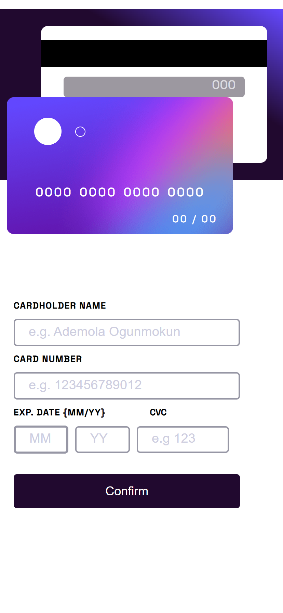
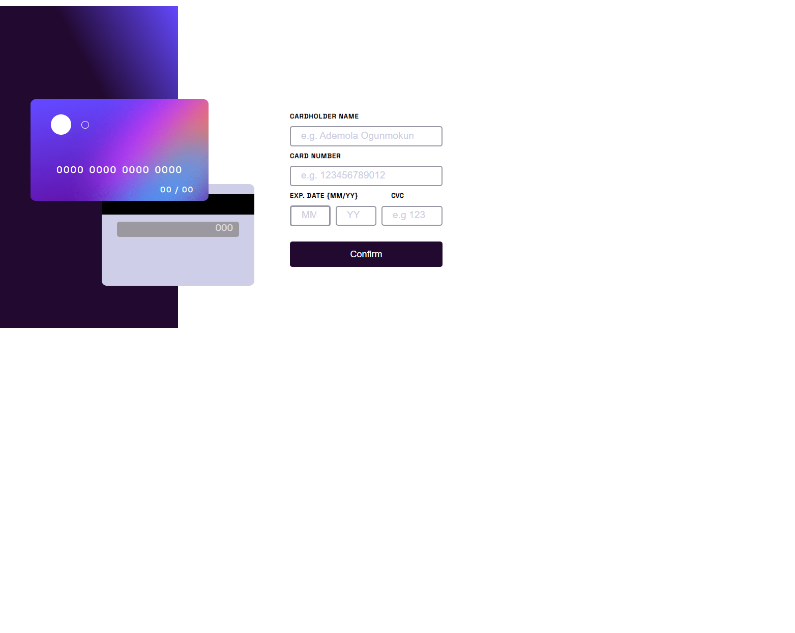

# Frontend Mentor - Interactive card details form solution

This is a solution to the [Interactive card details form challenge on Frontend Mentor](https://www.frontendmentor.io/challenges/interactive-card-details-form-XpS8cKZDWw). Frontend Mentor challenges help you improve your coding skills by building realistic projects.

- [Frontend Mentor - Interactive card details form solution](#frontend-mentor---interactive-card-details-form-solution)
  - [Overview](#overview)
    - [The challenge](#the-challenge)
    - [Screenshot](#screenshot)
      - [mobile](#mobile)
      - [Desktop](#desktop)
  - [My process](#my-process)
    - [Links](#links)
    - [Built with](#built-with)
    - [What I learned](#what-i-learned)
  - [Author](#author)

## Overview

### The challenge

Users should be able to:

- Fill in the form and see the card details update in real-time
- Receive error messages when the form is submitted if:
  - Any input field is empty
  - The card number, expiry date, or CVC fields are in the wrong format
- View the optimal layout depending on their device's screen size
- See hover, active, and focus states for interactive elements on the page

### Screenshot

#### mobile

#### Desktop

## My process

### Links

- Live Site URL: [Interactive Card](https://interactive-card-page.netlify.app/)

### Built with

- Semantic HTML5 markup
- CSS custom properties
- Flexbox
- Mobile-first workflow
- [React](https://reactjs.org/) - JS library
- [React-hook-form](https://react-hook-form.com/) - library for form handling
- [Styled Components](https://styled-components.com/) - For styles

### What I learned

I learnt how to work with React-hook-form.

## Author

- Website - [Ademola Portfolio](https://ademola-ogun.netlify.app/)
- GitHub: [@Ademola101](https://github.com/Ademola101)
- LinkedIn: [Ademola Ogunmokun](https://linkedin.com/in/ademola-ogunmokun-492575203)
- Frontend Mentor - [@Ademola101](https://www.frontendmentor.io/profile/Ademola101)
- Twitter - [@ademola_isr](https://twitter.com/ademola_isr)
  